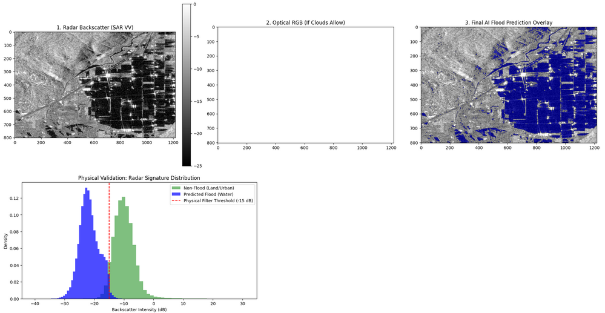

<div align="center">

# 🛰️ Flood Intelligence AI

### Satellite-Driven Flood Detection & Tactical Damage Assessment

**U-Net Deep Learning** · **Sentinel-1/2 SAR+Optical Fusion** · **Wide-Area Grid Tiling**

[](https://python.org)
[](https://fastapi.tiangolo.com)
[](https://tensorflow.org)
[](https://nodejs.org)
[](https://threejs.org)
[](LICENSE)

<br>

[](https://flood-saas-project.pages.dev)


</div>

---

## Table of Contents

- [Philosophy & Vision](#philosophy--vision)
- [System Architecture](#system-architecture)
- [Core Methodology & AI Logic](#core-methodology--ai-logic)
- [System Constraints & Sensor Limitations](#system-constraints--sensor-limitations)
- [Directory Structure & File Roles](#directory-structure--file-roles)
- [Setup & Execution](#setup--execution)
- [API Reference](#api-reference)
- [Future Roadmap](#future-roadmap)
- [License](#license)

---

## Philosophy & Vision

**Flood Intelligence AI** is an end-to-end geospatial intelligence platform that detects flood extent from satellite imagery, quantifies infrastructure damage, and renders the results inside a cinematic **Tactical Mission Control** interface.

### Design Aesthetic

The frontend rejects conventional dashboard design in favor of a **Cyberpunk / Ghost-in-the-Shell** tactical HUD — a cardless, data-layer architecture where information floats over a 3D Earth globe rendered with Three.js. Corner brackets replace card borders. Monospaced typography (`JetBrains Mono`, `Space Mono`) replaces sans-serif defaults. Cyan neon-glow accents and glassmorphism panels replace flat Material boxes.

When a scan completes, a choreographed camera interpolation zooms the globe into the target coordinates, cross-fading into a 2D Leaflet tactical map where georeferenced flood polygons are overlaid in real time.

<div align="center">
  
  <br>
  <sub><strong>Figure:</strong> Live Tactical Mission Control Interface — Seamless 3D Global Overview to 2D Flood Extent Transition</sub>
</div>

### AI Philosophy

The inference engine combines the **pattern recognition** of a trained U-Net deep learning model with the **physical grounding** of Synthetic Aperture Radar (SAR) backscatter thresholds. The model ingests an 8-channel composite — 2 SAR polarizations (VV, VH) fused with 6 optical spectral bands (B2, B3, B4, B8, B11, B12) — enabling it to distinguish between permanent water bodies, agricultural flooding, and urban inundation.

A **Smart Cloud Fallback** safety net prevents model hallucination when dense cloud cover eliminates all optical signal, while preserving legitimate double-bounce flood signals in vegetated agricultural regions.

### Architecture Philosophy

Wide-area disaster scanning (up to **400 km²** per request) is achieved through a **CPU-optimized Grid-Tiling Engine** that subdivides the area of interest into 5×5 km tiles, fetches satellite data concurrently via `ThreadPoolExecutor`, runs per-tile AI inference, and mosaics the results into a seamless output raster. This design eliminates Earth Engine timeout failures and operates without GPU dependencies — suitable for serverless or containerized deployment.

---

## System Architecture

```text
┌───────────────────────────────────────────────────────────────────┐
│               FRONTEND (Hosted on Cloudflare Pages)               │
│   Vanilla JS · Three.js Globe · Leaflet Map · Tactical HUD        │
│   ┌─────────────┐ ┌──────────────┐ ┌──────────────────────────┐   │
│   │ Left Panel  │ │ 3D Globe /   │ │ Right Panel              │   │
│   │ Mission     │ │ 2D Tactical  │ │ AI Confidence Gauge      │   │
│   │ Parameters  │ │ Map View     │ │ Damage Metrics           │   │
│   └─────────────┘ └──────────────┘ └──────────────────────────┘   │
│   ┌──────────────────────────────────────────────────────────┐    │
│   │ Bottom Panel — System Log (dynamic asynchronous polling) │    │
│   └──────────────────────────────────────────────────────────┘    │
└──────────────┬────────────────────────▲───────────────────────────┘
               │ 1. POST /api/scan      │ 3. GET /api/status/{task_id} (every 5s)
               ▼                        │    (Polling Loop)
┌───────────────────────────────────────┴──────────────────────────┐
│                      API GATEWAY (Worker)                        │
│   Intercepts requests, handles CORS preflights, injects auth.    │
└──────────────┬────────────────────────▲──────────────────────────┘
               │ 2. Forward POST        │ 4. Forward GET status
               ▼                        │
┌───────────────────────────────────────┴──────────────────────────┐
│                      AI ENGINE (FastAPI)                         │
│   Uses BackgroundTasks to process grid analysis asynchronously.   │
│   Tracks status in-memory via uuid task ID keys.                  │
│                                                                   │
│   ┌──────────┐   ┌──────────────┐   ┌──────────────────────────┐  │
│   │ GEE      │──▶│ AI           │──▶│ GIS Post-Processing      │  │
│   │ Fetcher  │   │ Segmentation │   │ Morphological Filtering  │  │
│   │          │   │ (U-Net)      │   │ Polygon Extraction       │  │
│   └──────────┘   └──────────────┘   │ OSM Damage Assessment    │  │
│                                     └──────────────────────────┘  │
│   ┌──────────────────────────────────────────────────────────┐    │
│   │         Grid Orchestrator (Wide-Area Tiling Mode)        │    │
│   │  generate_grid → ThreadPoolExecutor → rasterio.merge     │    │
│   └──────────────────────────────────────────────────────────┘    │
└───────────────────────────────────────┬──────────────────────────┘
                                        │
                                        ▼
                           ┌─────────────────────────┐
                           │   Google Earth Engine   │
                           │          (GEE)          │
                           └─────────────────────────┘
```

---

## Core Methodology & AI Logic

### 1. Multi-Sensor Data Ingestion

| Channel | Source | Band | Purpose |
|---------|--------|------|---------|
| 0 | Sentinel-1 SAR | **VV** | Vertical-transmit/Vertical-receive backscatter |
| 1 | Sentinel-1 SAR | **VH** | Vertical-transmit/Horizontal-receive backscatter |
| 2 | Sentinel-2 MSI | **B2** | Blue (490 nm) |
| 3 | Sentinel-2 MSI | **B3** | Green (560 nm) |
| 4 | Sentinel-2 MSI | **B4** | Red (665 nm) |
| 5 | Sentinel-2 MSI | **B8** | NIR (842 nm) |
| 6 | Sentinel-2 MSI | **B11** | SWIR-1 (1610 nm) |
| 7 | Sentinel-2 MSI | **B12** | SWIR-2 (2190 nm) |

SAR channels are normalized from `[-25, 0] dB` → `[0, 1]`. Optical channels are clipped at `3000` and divided to `[0, 1]`.

### 2. Patchify / Unpatchify Pipeline

The 8-channel GeoTIFF is padded to the nearest multiple of 256, then decomposed into **256×256×8 patches** using `patchify`. Each patch is fed to the U-Net independently. The per-patch probability maps are reassembled via `unpatchify`, then cropped back to the original image dimensions.

### 3. Smart Cloud Fallback

```
IF max(optical_bands[2:8]) == 0.0:
    ⚠ Dense cloud cover detected — optical data is missing
    → Apply strict SAR threshold: mask out pixels where VV > -14.0 dB
    → Prevents U-Net from hallucinating 100% flood masks

ELSE:
    ✓ Optical data present — trust the U-Net prediction as-is
    → Preserves agricultural double-bounce flood signals
```

This conditional safety net was engineered specifically to handle the failure mode where the U-Net, trained on 8-channel data, saturates to full-flood predictions when 6 of its 8 input channels are zeroed out by cloud cover.

### Visual Validation: Hybrid SAR Fallback



*Fig 1: The engine successfully applying the SAR physical threshold (-15 dB) during a 100% cloud-cover event (Optical RGB is blank), accurately isolating flood polygons from background land.*

### 4. Post-Processing Pipeline

1. **Morphological Smoothing** — Binary opening + closing with a 3×3 structuring element removes salt-and-pepper noise.
2. **Polygon Extraction** — `rasterio.features.shapes()` converts the binary mask to vector polygons.
3. **Area Filtering** — Polygons smaller than 1000 m² are discarded.
4. **Geometry Simplification** — Douglas-Peucker simplification (5m tolerance) reduces polygon vertex count for efficient frontend rendering.
5. **Infrastructure Assessment** — OpenStreetMap data (via OSMnx) is spatially intersected with flood polygons to quantify affected buildings, road segments, and agricultural land.

### 5. Grid-Tiling Engine

For scans with `radius_km > 0`:

1. **Grid Generation** — `generate_grid()` calculates tile centers in a WGS-84 grid pattern, filtering tiles whose centers fall outside the circular AOI.
2. **Concurrent Processing** — `ThreadPoolExecutor` dispatches tile workers that independently fetch GEE data and run inference. Thread-based parallelism is used because the bottleneck is I/O (GEE downloads), and TensorFlow's `model.predict()` releases the GIL.
3. **Raster Mosaicking** — `rasterio.merge.merge()` combines all per-tile mask GeoTIFFs into a single seamless flood mask.
4. **Cleanup** — Per-tile workspace directories are removed after mosaicking.

---

## System Constraints & Sensor Limitations

Disaster mapping platforms operating at the edge must account for the physical constraints of satellite remote sensing. This platform addresses and operates within the following operational envelopes:

### 📡 1. Optical Cloud Obscuration
* **Constraint:** Heavy precipitation and thick storm clouds completely block Sentinel-2 MSI multispectral optical sensors, zeroing out 6 of the 8 model input bands.
* **Mitigation:** The **Smart SAR Fallback** architecture automatically detects blank optical bands at runtime. It shifts inference logic to rely exclusively on the **Sentinel-1 C-band Synthetic Aperture Radar (SAR)** polarization bands (VV/VH), which penetrate cloud cover and operate independently of solar illumination.

### 🏙️ 2. SAR Speckle Noise & Urban Layover
* **Constraint:** Synthetic Aperture Radar is highly sensitive to surface geometry. In dense metropolitan zones, high-rise building walls produce strong radar echoes (the **double-bounce** effect). In addition, radar backscatter displays inherent granular noise ("speckle").
* **Mitigation:** The post-processing pipeline mitigates this by running aggressive morphological filtering (opening and closing kernels) combined with OpenStreetMap geometry masks to filter false positives and double-bounce outliers in built-up urban grids.

### 🕒 3. Temporal Resolution (Constellation Revisit Time)
* **Constraint:** Satellite scans do not represent real-time continuous video feeds. Sentinel satellite constellation revisits over any single coordinate occur every **3 to 12 days** depending on the latitude and orbital pass.
* **Mitigation:** The platform acts as a *near-real-time (NRT)* tactical assessment portal. The UI explicitly logs the satellite observation timestamp to warn operators of the exact latency between the satellite capture time and the disaster timeline.

---

## Directory Structure & File Roles

<details>
<summary>📂 View Repository Tree & Component Mapping</summary>

```
Flood_SaaS_Project/
│
├── frontend/src/                    # Client — Tactical Mission Control UI
│   ├── index.html                   # Main HTML shell (3-panel CSS Grid layout)
│   ├── index.js                     # Core logic: Three.js globe, Leaflet map,
│   │                                #   scan polling, transition choreography,
│   │                                #   tactical progress stream, dossier loader
│   ├── tactical.css                 # Full design system: CSS Grid layout, HUD,
│   │                                #   glassmorphism panels, neon-glow accents,
│   │                                #   dossier modal, CRT scan-line animations
│   ├── about_component.html         # Dynamically-loaded Intel Dossier modal
│   ├── getEarthMat.js               # Three.js Earth material (day/night textures)
│   ├── getFresnelMat.js             # Atmospheric Fresnel glow shader
│   ├── getLayer.js                  # Cloud/city-light overlay layers
│   ├── getStarfield.js              # Procedural star particle system
│   └── textures/                    # Earth, cloud, and night-light texture maps
│
├── backend-node/                    # API Gateway & Deployment
│   ├── worker.js                    # Serverless Cloudflare Worker (routing, CORS, proxy)
│   ├── wrangler.toml                # Wrangler worker configuration metadata
│   └── package.json                 # Worker dev dependencies
│
├── ai-engine-python/                # AI Engine — FastAPI + TensorFlow
│   ├── main.py                      # FastAPI app: /api/v1/analyze_flood endpoint,
│   │                                #   dual-mode background branching, task status endpoint,
│   │                                #   model lifecycle management
│   ├── Dockerfile                   # Container configuration
│   ├── core/
│   │   ├── gee_fetcher.py           # Google Earth Engine interface: fetches 8-channel
│   │   │                            #   Sentinel-1 + Sentinel-2 composites as GeoTIFF
│   │   ├── ai_segmentation.py       # U-Net inference: patchify, predict, unpatchify,
│   │   │                            #   Smart Cloud Fallback, confidence scoring
│   │   ├── gis_metrics.py           # Morphological filtering, polygon extraction,
│   │   │                            #   OSM damage assessment, GeoJSON export
│   │   └── grid_orchestrator.py     # Wide-area grid tiling: tile generation,
│   │                                #   concurrent execution, raster mosaicking
│   ├── models/                      # Pre-trained U-Net weights (.keras)
│   ├── auth/                        # GEE service account credentials
│   ├── live_data/                   # Runtime satellite downloads & inference outputs
│   ├── cache/                       # Cached intermediate results
│   └── flood_outputs/               # Exported flood masks and GeoJSON
│
└── requirements.txt                 # Python dependency manifest
```

</details>

---

## Setup & Execution

### Prerequisites

| Requirement | Version |
|---|---|
| **Python** | 3.10+ |
| **Node.js** | 18+ |
| **npm** | 9+ |
| **Google Earth Engine** | Authenticated service account |

### 1. Clone the Repository

```bash
git clone https://github.com/HassanAhmed2Hassan/Flood_SaaS_Project.git
cd Flood_SaaS_Project
```

### 2. Configure Google Earth Engine

Place your GEE service account credentials at:
`ai-engine-python/auth/gee_service_account.json`

> [!WARNING]
> Ensure the service account has active Google Earth Engine API access enabled in your Google Cloud Console.

Update the project ID in `core/gee_fetcher.py`:

```python
ee.Initialize(project='YOUR_GEE_PROJECT_ID')
```

### 3. Install & Start the Python AI Engine

To install dependencies and boot the FastAPI backend:
```bash
cd ai-engine-python
pip install -r ../requirements.txt
python main.py
```

The engine will load the U-Net model weights into memory and start the server at `http://localhost:8000`.

### 4. Deploy the Cloudflare Worker API Gateway

Ensure you have a Cloudflare account. Set your Hugging Face authentication token as a secret in your Worker:

```bash
cd backend-node
npm install
npx wrangler secret put HF_TOKEN
# Enter your Hugging Face Space Authorization Token when prompted
```

Deploy the worker globally to the Cloudflare Edge network:

```bash
npx wrangler deploy
```

> [!NOTE]
> The gateway worker will deploy to a subdomain under `*.workers.dev` (e.g., `https://flood-api-gateway.your-subdomain.workers.dev`) and automatically handle routing and CORS preflights.

### 5. Deploy the Frontend on Cloudflare Pages

The frontend operates as a static site and is hosted globally via Cloudflare Pages:

1. Push your repository to GitHub.
2. Go to your **Cloudflare Dashboard** → **Workers & Pages** → **Create application** → **Pages** → **Connect to Git**.
3. Select the `Flood_SaaS_Project` repository.
4. Set the **Build settings**:
   - **Framework preset**: `None` (Static HTML/JS)
   - **Build command**: Leave blank
   - **Build output directory**: `frontend/src`
5. Click **Save and Deploy**.

Cloudflare Pages will build the frontend and serve it at a public `https://*.pages.dev` URL.

---

## API Reference

The serverless architecture operates on a two-step asynchronous task polling model via the Cloudflare Worker API Gateway.

### Step 1: Submit Scan Request

`POST /api/scan` (Gateway) | `POST /api/v1/analyze_flood` (AI Engine)

#### Request Body

```json
{
  "latitude": 13.5,
  "longitude": 33.3,
  "start_date": "2021-11-16",
  "end_date": "2021-11-26",
  "radius_km": 20,
  "tile_size_km": 5,
  "max_workers": 4
}
```

| Field | Type | Default | Description |
|---|---|---|---|
| `latitude` | `float` | *required* | Target latitude (WGS-84) |
| `longitude` | `float` | *required* | Target longitude (WGS-84) |
| `start_date` | `string` | *required* | Observation window start (YYYY-MM-DD) |
| `end_date` | `string` | *required* | Observation window end (YYYY-MM-DD) |
| `radius_km` | `float` | `0` | Scan radius (km). `0` = single-tile legacy mode |
| `tile_size_km` | `float` | `5.0` | Grid tile dimension (km) |
| `max_workers` | `int` | `4` | Concurrent thread count for grid mode |

#### Response

Returns a task identifier immediately without waiting for AI analysis to complete.

```json
{
  "task_id": "9b1deb4d-3b7d-4bad-9bdd-2b0d7b3dcb6d"
}
```

---

### Step 2: Poll Task Status

`GET /api/status/{task_id}` (Gateway) | `GET /api/v1/task_status/{task_id}` (AI Engine)

#### URL Parameters

| Parameter | Type | Description |
|---|---|---|
| `task_id` | `string` | UUID generated during Step 1 |

#### Response (Processing)

```json
{
  "status": "processing"
}
```

#### Response (Completed)

When task completion is successful, the full geospatially fused metrics are returned.

```json
{
  "status": "completed",
  "data": {
    "status": "success",
    "mode": "grid",
    "confidence_score": 99.73,
    "grid_summary": {
      "total_tiles": 49,
      "tiles_ok": 47,
      "tiles_failed": 2
    },
    "metrics": {
      "total_flood_area_sqkm": 42.7,
      "buildings_damaged": 1247,
      "roads_damaged_km": 18.3,
      "farmland_damaged_sqkm": 31.2
    },
    "geojson": {
      "type": "FeatureCollection",
      "features": [...]
    }
  }
}
```

#### Response (Failed)

If an error occurs during satellite ingestion or inference processing.

```json
{
  "status": "failed",
  "error": "Failed to fetch satellite data. Clouds too dense or wrong dates."
}
```

---

## Future Roadmap

To transition this tactical operations system into an active autonomous coordinator, we are planning the integration of the following next-generation telemetry and analysis systems:

1. **Predictive LLM-based Casualty & Displacement Estimation**
   - Leverage fine-tuned Large Language Models (LLMs) to cross-reference real-time flood polygons and structural damage metrics with high-resolution demographic datasets (e.g., LandScan).
   - Generate automated emergency reports, projecting critical rescue zones, estimated displacement counts, and resource shortages within the first 15 minutes of satellite ingestion.

2. **Autonomous Drone Swarm Telemetry Ingestion**
   - Implement real-time WebRTC or RTMP video/data feeds from tactical drone swarms.
   - Run sub-decimeter edge-AI object detection on incoming feeds to locate stranded individuals, identify floating hazards, and dynamically map escape routes under tree cover where satellites cannot see.

3. **Automated Warning Dispatch & Ground Responder Routing**
   - Integrate with Twilio, WhatsApp, and CAP (Common Alerting Protocol) gateways to automatically broadcast localized emergency alerts to residents inside the predicted flood path.
   - Generate optimal multi-agent routing profiles (using pgRouting or OSRM) for search-and-rescue teams, routing around flooded roads and structurally compromised bridges.

---

## About the Developer

Built by Hassan, a Bioinformatics student and AI/Remote Sensing Engineer passionate about geospatial intelligence.

- [LinkedIn: Hassan Ahmed](https://www.linkedin.com/in/hassan-ahmed2007/)
- [Portfolio: Hassan Ahmed](https://hassan-ahmed-portfolio.vercel.app/)

---

## License

This project is released under the **MIT License**.

---

<div align="center">
  <sub>Built by <strong>Hassan</strong> — AI & Remote Sensing Engineer</sub>
</div>

__________________________________